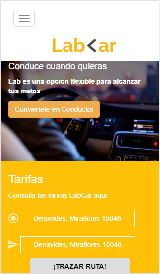
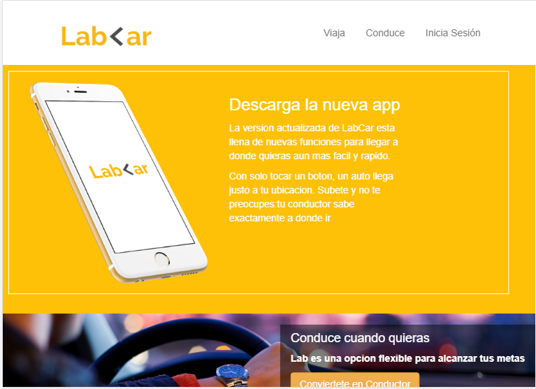
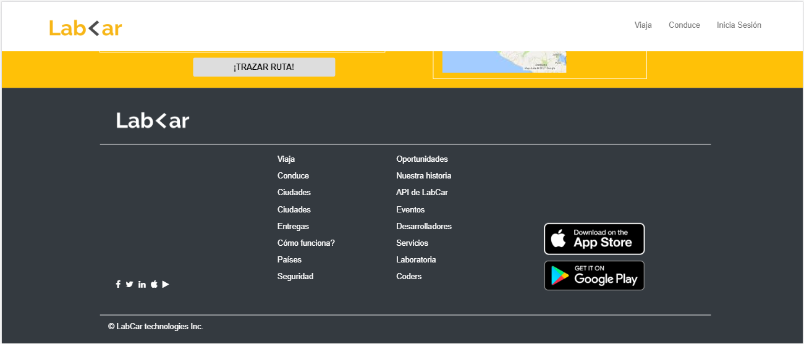

# LabCar challenge

* **Track:** _Common Core_
* **Curso:** _Crea tu propia red social_
* **Unidad:** _No reinventes la rueda_
* **Tipo de trabajo:** Colaborativo
* **Equipo:** Victoria Lung y Valeria Valles

***
Nuestra  web **LabCar** representa el primer trabajo de reto de código correspondiente al **Spring 3**.

## Objetivo

El reto consiste en replicar la web **LabCar** utilizando el framework Bootstrap, Responsive design, Media queries, Mobile first. 

## Flujo de trabajo:

1. Nuestro flujo de trabajo es colaborativo y se comenzo fijando dos parametros de organizacion grupal: metas a corto plazo,comunicación y  reuniones presenciales.

2.El proyecto se hizo teniendo en cuenta el concepto de Mobile first, ya que  es  primordial dar una buena experiencia al usuario.

## Muestra del proyecto:

-  Versión mobile 

 
 
 
-  Versión tablet

 
 

-  Versión desktop

 