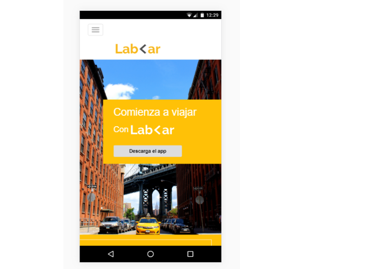

# LabCar challenge

* **Track:** _Common Core_
* **Curso:** _Crea tu propia red social_
* **Unidad:** _No reinventes la rueda_

***
Nuestra  web **LabCar** representa el primer trabajo de reto de código correspondiente al **Spring 3**.

## Objetivo

El reto consiste en replicar la web **LabCar** haciendo utilizando el framework Bootstrap, Responsive design, Media queries, Mobile first.

- Imagen version mobile

## Flujo de trabajo:

1. Nuestro flujo de trabajo comienza con inspeccionar la que se va a replicar en la evaluación

2. Recabar las fuentes , imagenes e iconos que se emplearan en la creacion de nuestra página web

3. Sólo replicar de la página web lo que se ha enseñado en clase.

